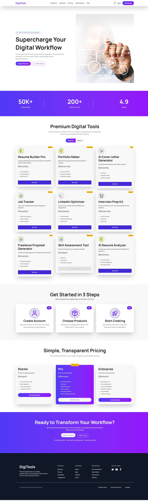

# 🚀 DigiTools Platform

## 🌐 Live Website
👉 https://fantastic-puffpuff-5877a8.netlify.app/

---

## 📌 Overview
DigiTools Platform is a modern web application that provides users with a collection of useful digital tools in one place. It is built with a focus on clean UI, performance, and responsive design.

---

## 🖼️ Screenshot


---

## 🛠️ Tech Stack
- ⚛️ React.js  
- ⚡ Vite  
- 🎨 Tailwind CSS  
- 🌼 DaisyUI  
- 🎯 React Icons  
- 🔔 React-Toastify  
- 📦 JSON (mock data)  

---

## ✨ Features

- 📱 Fully responsive design (mobile, tablet, desktop)
- 🎨 Modern gradient-based UI
- 🛒 Dynamic cart system with live updates
- ⚡ Fast and optimized performance (Vite)
- 🔔 Toast notifications for better UX
- 🧩 Modular and reusable components

---

## 🚀 Getting Started

```bash
# Install dependencies
npm install

# Run development server
npm run dev
